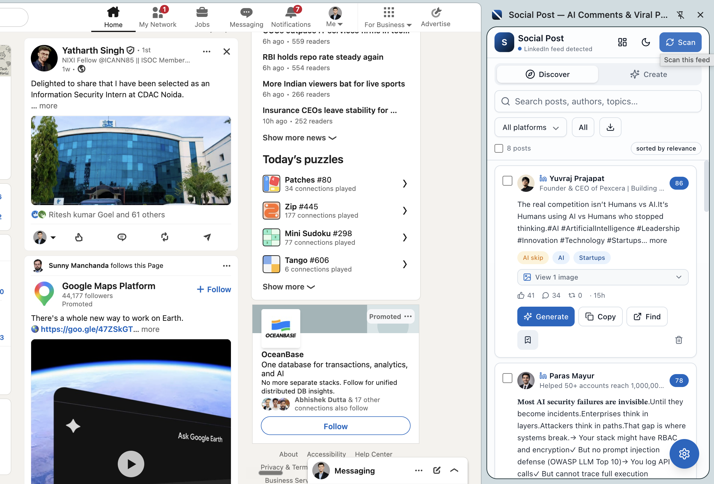
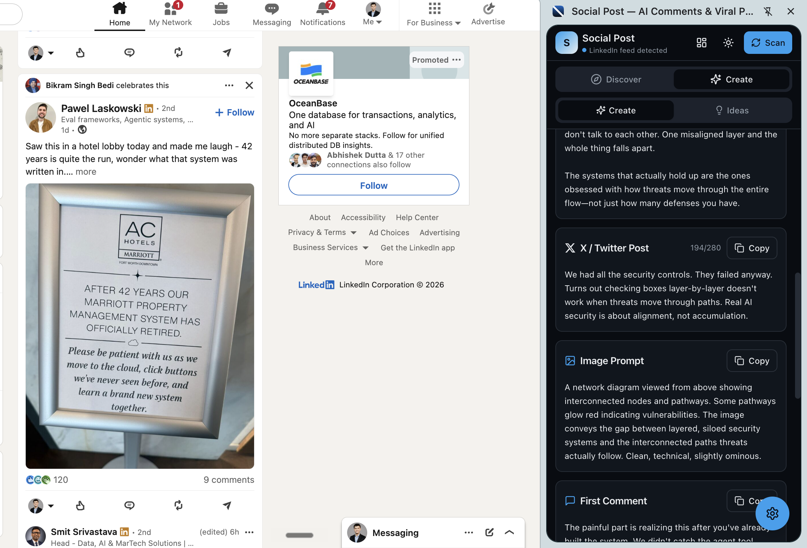
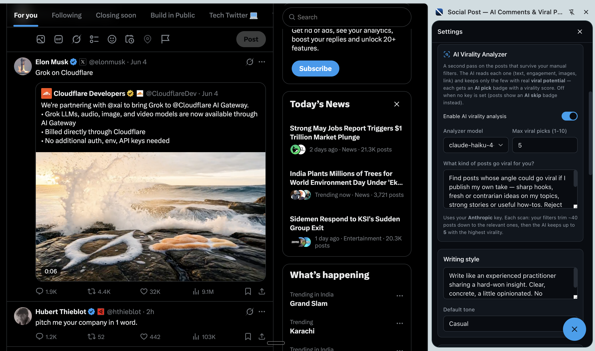
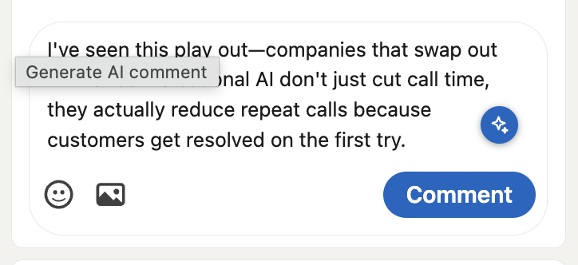
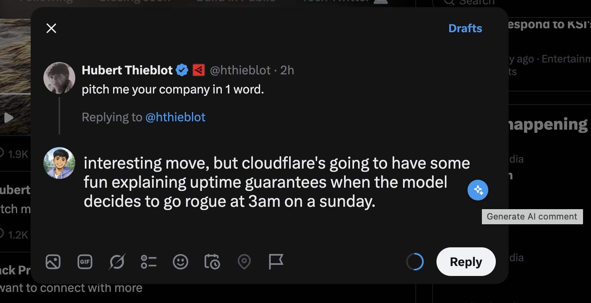

<p align="center">
  
</p>

<h1 align="center">Social Post</h1>

<p align="center">
  <b>An AI copilot for LinkedIn &amp; X (Twitter), living entirely in your browser's side panel.</b><br/>
  Scan your feed → let AI surface the posts most likely to go viral → generate original posts, comments, and content ideas — and drop a one-click AI comment right inside any post.
</p>

<p align="center">
  <a href="#-quick-start"></a>
  
  
  
</p>

---

## ✨ What it does

Most "AI content" tools are SaaS dashboards that want your password, your data, and a subscription. **Social Post is the opposite:** a Manifest V3 Chrome extension that runs 100% on your machine, stores everything locally (IndexedDB), and talks only to the AI provider whose key *you* supply.

It does four things, in one side panel:

1. **Discover** — one click scans your LinkedIn/X feed, scrapes posts (text, images, engagement, links), filters out ads/noise, and an **AI virality analyzer** keeps only the handful most worth learning from.
2. **Create** — turn any discovered post (or a blank prompt) into an original **LinkedIn post + X post + image prompt + first comment + follow-ups + hashtags**, written in your voice.
3. **Ideas** — brainstorm content ideas, trending themes, contrarian takes, educational angles, and personal-story prompts, grounded in what you actually scanned.
4. **Comment anywhere** — a ✦ button appears inside every LinkedIn/X comment box; click it to generate a short, human, on-context comment (it even reads the post's image alt-text) and inserts it for you to edit and post.

---

## 🎯 Motivation

Posting consistently on LinkedIn and X is how careers, audiences, and products grow — but the loop is painful:

- **Finding signal is slow.** Feeds are 90% ads, hiring posts, and motivational filler. The 10% worth engaging with is buried.
- **The blank page is hard.** Even with a good idea, drafting a post or a non-generic comment takes time you don't have.
- **Most tools are creepy.** They ask you to log in *to LinkedIn through them*, upload your data to a server, and pay monthly.

Social Post compresses the loop — **scan → curate → write → engage** — into a side panel that never leaves your browser, and lets you bring whichever AI model you already pay for. It's the tool I wanted: fast, private, and honest about what it does.

---

## 📸 Screenshots

<p align="center">
  
  <br/>
  <em>Discover — one click scans your feed; the AI keeps only the posts worth your attention (note the ⚡ AI-pick badges and the ✦ comment button on the page).</em>
</p>

<table>
  <tr>
    <td width="50%" valign="top">
      <br/>
      <strong>Create</strong> — turn one post into a LinkedIn post, an X post, an image prompt, and ready-to-use comments &amp; hashtags.
    </td>
    <td width="50%" valign="top">
      <br/>
      <strong>AI Virality Analyzer</strong> — describe what goes viral for you; it scores and curates every scan (shown in dark mode beside X).
    </td>
  </tr>
  <tr>
    <td width="50%" valign="top">
      <br/>
      <strong>Comment on LinkedIn</strong> — the ✦ button writes a warm, on-context comment in your voice, inserted ready to edit.
    </td>
    <td width="50%" valign="top">
      <br/>
      <strong>Reply on X</strong> — a punchy, human one-liner generated right inside the reply box.
    </td>
  </tr>
</table>

---

## 🧩 Features

**Discovery & curation**
- One-click **feed scanner** for LinkedIn and X — auto-scrolls and collects ~40 posts with a live `0→40` progress bar.
- For every post it captures: author, headline, text, **images**, video flag, likes / comments / reposts, timestamp, permalink, and a raw-HTML snapshot for debugging.
- **Manual filters:** content filters (politics, religion, NSFW, spam, giveaways, job posts), blacklist keywords, min-engagement, max-age, and a tunable relevance score.
- **AI Virality Analyzer (optional):** the relevant survivors go to the LLM, which scores each for *viral potential* (hook, novelty, shareability, **and proven engagement** like comment-to-like ratio) and keeps only the top picks — each with a **virality score + reason**.
- Posts show an **"⚡ AI pick · score"** badge when AI-curated, or a yellow **"AI skip"** badge when they came through manual filters only (no key configured).

**Creation**
- Generate a full bundle: **LinkedIn post**, **X post**, **image prompt**, **first comment**, **follow-up comments**, and **hashtags** — from a source post or from scratch.
- Tone presets (professional, casual, bold, analytical, storyteller, witty) + a free-text writing-style persona.
- **Suggested comments** for any post (early comment, engagement booster, follow-up, audience question).
- **Ideas** across six buckets, grounded in your scanned posts.
- One-click **copy** on every field; **bulk generate** across multiple selected posts.

**In-page comment assistant**
- A ✦ button inside LinkedIn/X comment boxes generates a short, human comment in your voice — LinkedIn gets a warm, professional 1–2 lines; X gets a punchy one-liner.
- Reads the post's text **and image alt-text** for real context; inserts straight into the editor (Quill/DraftJS-aware).

**Quality-of-life**
- **Blue + black theme** (LinkedIn blue / X black) with inverted light & dark modes.
- Inline **image viewer** on cards, clickable author + post permalinks.
- Select / multi-select / **select-all** + **bulk delete** on the feed and on generated posts.
- **JSON export / backup** (API keys are stripped from exports).
- Dashboard with totals, today's count, top topics, and top sources.

---

## 🔐 Privacy &amp; security

This is the whole point, so it's worth being precise.

- **Local-first.** Every scanned post, generated draft, and setting lives in your browser's **IndexedDB**. There is no backend, no account, no analytics, no telemetry.
- **Bring your own key.** You paste a Gemini / OpenAI / Anthropic key (or a custom base URL). The **only** outbound network calls are from your browser directly to *that* provider, carrying only the prompt + the post text you chose.
- **Your keys never touch the web page.** The API key is held in the extension's storage and used **only** by the background service worker. The content scripts that run on `linkedin.com` / `x.com` never receive it — so a malicious page (or a compromised LinkedIn/X) can't read it. The in-page comment button sends the *post text* to the background worker and gets back a *comment*; the key stays on the extension side.
- **Keys are sent in headers, not URLs.** Gemini uses the `x-goog-api-key` header (not a query string), OpenAI uses `Authorization: Bearer`, Anthropic uses `x-api-key`. Nothing is logged.
- **Backups exclude secrets.** The JSON export blanks all three API-key fields.
- **Minimal permissions.** The only Chrome permission requested is **`sidePanel`**. Host access is scoped to LinkedIn, X/Twitter, and the three AI API hosts (plus `localhost` for self-hosted models). No "read your browsing history," no broad `tabs` permission.

> Honest caveat: data at rest is only as protected as your OS/browser profile (the standard for any BYO-key tool). The extension does not add a passphrase layer, because that would mean unlocking it every session.

---

## 🧠 How it works

```
 Toolbar icon ──▶ Background SW enables openPanelOnActionClick ──▶ Side panel opens

 ┌──────────────── SCAN ────────────────┐
 │ Side panel ─▶ content script (LinkedIn/X tab)                     │
 │             ◀─ scroll + scrape ~40 posts (live progress)         │
 └───────────────────────────────────────┘
                 │ RawPost[]
                 ▼
 ┌──────────── INGEST (two stages) ──────────┐
 │ 1. Manual filter: drop ads/spam/jobs/off-topic, score relevance, dedupe │
 │ 2. AI virality pass (if key + enabled): rank survivors, keep top N      │
 └────────────────────────────────────────────┘
                 │ Post[] (with analysis verdicts)
                 ▼  stored in IndexedDB (Dexie)
        Discover · Create · Ideas read from storage and call the AI provider

 ┌──────── IN-PAGE COMMENT ────────┐
 │ ✦ button → content script reads the post (text + image alt-text)        │
 │          → background worker (holds the key) → AI → comment             │
 │          → inserted into the comment box                                │
 └──────────────────────────────────┘
```

**Why this split?** The agent loop and key-bearing logic live in the **background service worker** (extension origin); the **content scripts** only read the DOM and render the button. That boundary is what keeps your key off the web page.

The LinkedIn permalink is reconstructed from the embedded activity-ID order when the page doesn't expose it on a DOM node; X permalinks come straight from the `/status/` link. Selectors are anchored on stable accessibility hooks (`aria-label`, `data-testid`, the post control menu) rather than LinkedIn's hashed class names, so a redesign degrades gracefully instead of silently breaking.

---

## 🛠️ Tech stack

| Area    | Choice                                                       |
| ------- | ------------------------------------------------------------ |
| UI      | React 18 · TypeScript · TailwindCSS · shadcn-style primitives |
| Build   | Vite 5 · `@crxjs/vite-plugin` (MV3)                          |
| Storage | IndexedDB via Dexie.js (repository pattern)                  |
| AI      | Gemini · OpenAI (+ compatible) · Anthropic — behind one `AIProvider` interface |
| Tests   | Vitest (relevance, filters, hashing, parsing, extraction)   |

---

## 🗂️ Project structure

```
src/
  background/      Service worker — opens the side panel + runs the comment generator (holds keys)
  content/         Feed scrapers (linkedin, twitter), the scan loop, and the in-page comment assistant
  sidepanel/       React app — App shell, hooks/, pages/ (Discover, Studio=Create+Ideas, Dashboard, Settings)
  components/      Shared components + ui/ (shadcn-style primitives)
  services/
    ai/            AIProvider interface · Gemini/OpenAI/Anthropic · analyzer · inline-comment · JSON parsing
    relevance/     score.ts (relevance engine) + filters.ts (content/blacklist)
    scanner/       messaging (panel↔content) + ingest pipeline (filter → analyze → store)
  prompts/         Reusable prompt templates (generate, comments, ideas, analyze, inline-comment)
  storage/         Dexie db + repositories (posts, topics, generated, prompts, settings, history)
  types/           Shared domain + message types
  utils/           logger, hash, dates, format, export, cn
scripts/           generate-icons.mjs (zero-dependency PNG icon generator)
manifest.config.ts · vite.config.ts · tailwind.config.js · tsconfig.json
```

**Architecture principles:** repository pattern over storage, a single pluggable `AIProvider` interface, typed message contracts between contexts, and a thin background worker. Swapping storage (→ a synced backend) or adding an AI provider is a localized change, not a rewrite.

---

## 🚀 Quick start

### Option A — Install the built extension (recommended)

1. Download/clone this repo and build it (below), **or** grab a release `dist/`.
2. Open `chrome://extensions`, enable **Developer mode** (top-right).
3. **Load unpacked** → select the `dist/` folder.
4. Pin the **Social Post** icon and click it — the side panel opens.
5. Open **Settings** (gear button, bottom-right) → paste your **AI API key**.
6. Open your LinkedIn or X feed → click **Scan**.

### Option B — Build from source

Prereqs: **Node 18+** (Node 22 recommended) and npm.

```bash
cd Social_post
npm install
npm run build      # type-checks, then outputs a loadable extension to ./dist
```

Then load `./dist` as an unpacked extension (steps 2–6 above).

### Development (hot reload)

```bash
npm run dev        # Vite + crxjs with HMR — load the generated ./dist
```

Edit a file and the panel/content scripts reload. After changing the manifest or content-script matches, reload the extension from `chrome://extensions`.

### Tests & types

```bash
npm test           # Vitest unit tests
npm run typecheck  # tsc --noEmit
```

---

## ⚙️ Configuration (Settings)

- **AI Provider** — Google Gemini, OpenAI (+ any OpenAI-compatible endpoint via a **custom base URL**: Ollama, LM Studio, Azure, Groq…), or Anthropic Claude. Pick the model from a curated list or type your own.
- **AI Virality Analyzer** — toggle on (default), choose its model, set max picks (1–10), and describe *what makes a post go viral for you*. Off → posts are shown with an "AI skip" badge.
- **Topics / keywords / blacklist**, **content filters**, **min engagement**, **max age**, **relevance threshold**, **posts per scan**, **scroll rounds**.
- **Writing style** (your persona) + default tone.
- **In-page AI comment button** — toggle the LinkedIn/X comment button on/off.
- **Dark mode**, **Backup JSON**, and clear/reset controls.

Get a key: [Google AI Studio](https://aistudio.google.com/app/apikey) · [OpenAI](https://platform.openai.com/api-keys) · [Anthropic](https://console.anthropic.com/settings/keys).

---

## 🔑 Permissions explained

| Permission | Why |
| --- | --- |
| `sidePanel` | The entire UI is a Chrome side panel. |
| `*.linkedin.com`, `*.x.com`, `*.twitter.com` | Read your feed to scan posts and render the in-page comment button. |
| `generativelanguage.googleapis.com`, `api.openai.com`, `api.anthropic.com` | Call the AI provider **you** configured. |
| `localhost`, `127.0.0.1` | Optional — talk to a self-hosted / local OpenAI-compatible model. |

No `storage`, `tabs`, `activeTab`, or `scripting` permissions are requested.

---

## 🗺️ Roadmap / future-ready

The interfaces are designed so these can be added without a rewrite: optional Supabase sync, scheduled scanning, a web dashboard, analytics, team collaboration, AI style profiles, similar-post clustering (a Jaccard `similarity()` helper already ships), a content calendar, and true multimodal (vision) analysis of post images.

---

## 🤝 Contributing

Issues and PRs welcome. To get going: `npm install`, `npm run dev`, and load `./dist`. Please run `npm test` and `npm run typecheck` before opening a PR, and match the existing code style (the repo is strict-TypeScript, no `any` unless justified).

Good first contributions: more robust LinkedIn/X selectors, additional AI providers behind `AIProvider`, and true multimodal (vision) analysis of post images.

---

## ⚠️ Notes &amp; limitations

- LinkedIn/X change their markup often. Selectors are layered with fallbacks; if a scan returns few posts, scroll the feed once and rescan.
- Image "context" for analysis and comments is the image **alt-text**, not true vision — reliable across providers without multimodal plumbing.
- Virality scores are a *prediction* from available signals, not a guarantee.
- The extension only reads what's already in **your** logged-in feed; it never logs in, posts, or acts on your behalf without a click.

---

## 📄 License

[MIT](LICENSE) © Social Post contributors.
